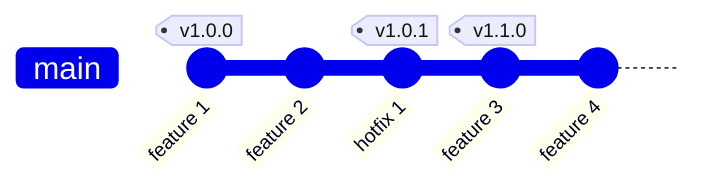
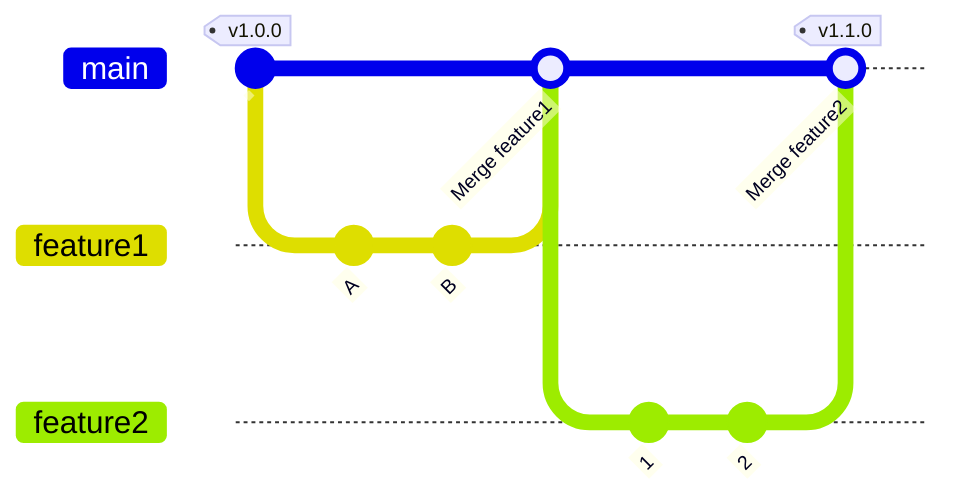
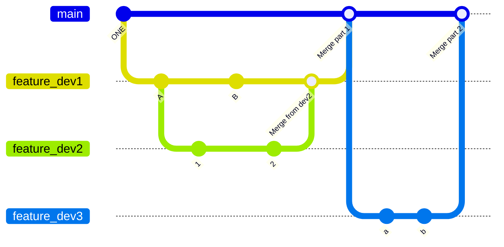
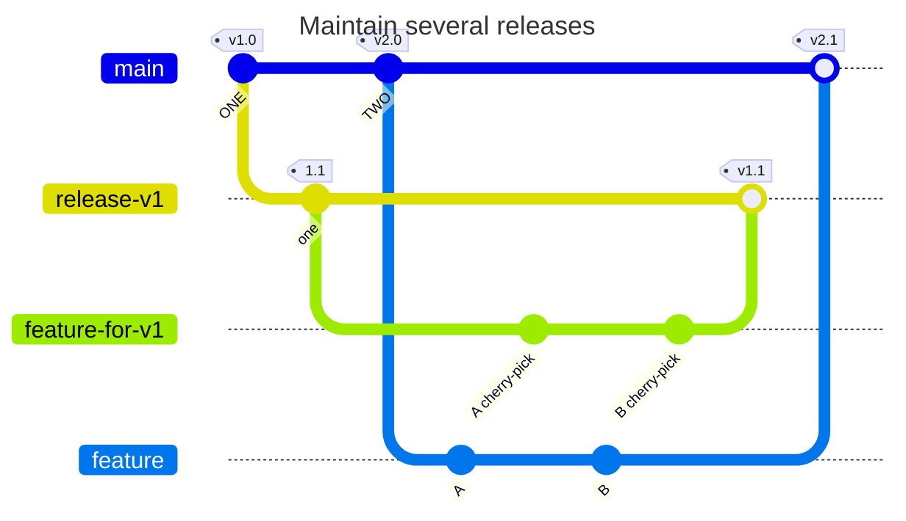

# Simplest Git Branching Model

This is a practical, lightweight, single-branch model that makes it easy to handle simple and less simple situations.

It is adapted to teams of several developers, delivering releases ASAP, maintaining several releases in parallel.

**TLDR**
```
    Single main branch
    One feature branch per task
    One dev per feature branch
    One PR per feature branch
    Delete feature branches after merge
```

Some more details below.

## Single branch model
* A branch `main` stores the latest version and all the tagged releases.
* Repository users must take care of checking out the tag or commit that best fits their needs.



## Adding features

### Adding a feature branch
* Add a `feature` branch checked out from `main`, like `git checkout main && git checkout -b feature`
* Only you (the developer) should use it.

### Publishing the feature
* Implement your feature in branch `feature`.
* Naming the branch is up to your dev rules.
* Rebase your branch onto `main`, like `git checkout feature && git rebase main`
* You (the developer) are responsible for the conflict management.
* Publish a Pull Request, or equivalent, from `feature` to `main` manually or using a [GitHub](https://github.com/) Pull Request or a [GitLab](https://gitlab.com/) Merge Request.

## Merging features
* You (the software manager) should merge the feature branch to `main`.
* :x: This merge should not be done with option `--fast-forward`.
* Naming the merge commit is up to your dev rules. 
* Delete the feature branch. Modifying sources within the same ticket must be done in a **new branch**.
* Put a new tag on `main` if needed.
* :white_check_mark: Branches should look like:


## Merging hotfixes
In this model hotfixes are treated as features.

## Complex feature treated by more than one developer
* Still one branch per developer.
* Devs can checkout from other dev branches.
* Merges must be done back onto their base branch. In the following case, `feature_dev2` couldn't directly be merged back to `main`.
* Bubble merges should also be avoided, devs should rebase their work onto the base branch.




## Maintaining several `main` branches
A common case is maintaining multiple major releases.
* Create a main branch per release. You could check out from a tag, like `git checkout v1.0 && git checkout -b release-v1`
* Keep separated feature branches for each release, even if the feature and change are the same. `git cherry-pick` can be your friend here.
* Publish one PR per release.



## Naming
* Naming dev branches, merge commits, tags is up to your dev rules.
* could include some issue ID from your Project Management Software.

## DONTs

* :x: Avoid bubble merges
    ```mermaid
    ---
    title: Bubble merge
    ---
    gitGraph
        commit id: "ONE"
        branch feature1
        checkout main
        commit id:"TWO"
        branch feature2
        checkout feature1
        commit id:"A"
        checkout feature2
        commit id:"1"
        checkout feature1
        commit id:"B"
        checkout main
        merge feature1 id:"Merge feature1"
        checkout feature2
        commit id:"2"
        checkout main
        merge feature2 id:"Merge feature2"
    ```

    This can be difficult to read when more than 2 branches overlap.

    * Consider rebasing `feature2` onto main, like `git checkout feature2 && git rebase main` :white_check_mark:
    * Don't merge `main` back to `feature2`, like `git checkout feature && git merge main` :x:, which will still lead to a bubble merge.

## Credits
* [Trunk-Based development workflow](https://trunkbaseddevelopment.com)
* [What is Git Flow](https://www.gitkraken.com/learn/git/git-flow)
* Popular Vincent Drissen's [A successful Git branching model](https://nvie.com/posts/a-successful-git-branching-model/), which I used for years (thank you Vincent)
* [GitLab Flow](https://about.gitlab.com/topics/version-control/what-is-gitlab-flow/)
* [GitHub Flow](https://docs.github.com/en/get-started/using-github/github-flow)
* Thanks to [jbenet](https://github.com/jbenet) for [this gist about a simple git branching model](https://gist.github.com/jbenet/ee6c9ac48068889b0912)
* Diagrams are done with [mermaid](https://mermaid.js.org/)
