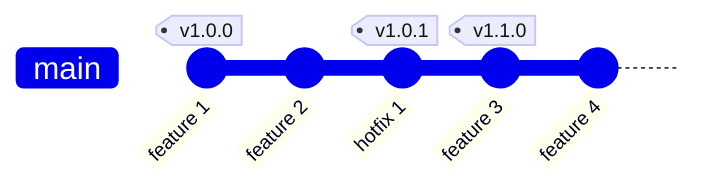
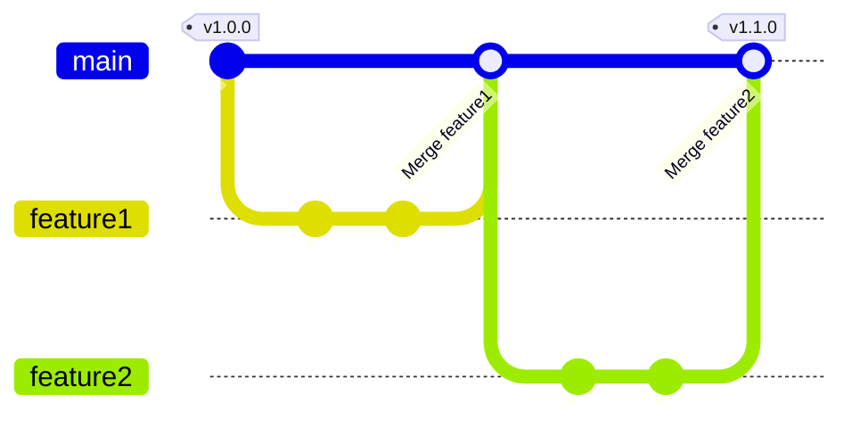
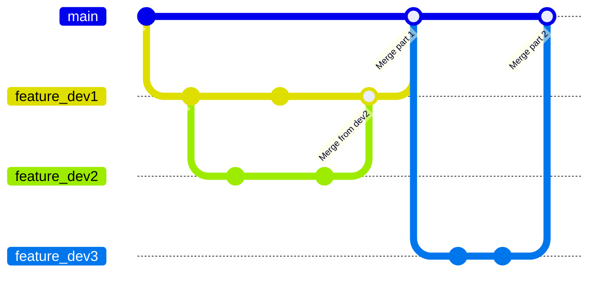
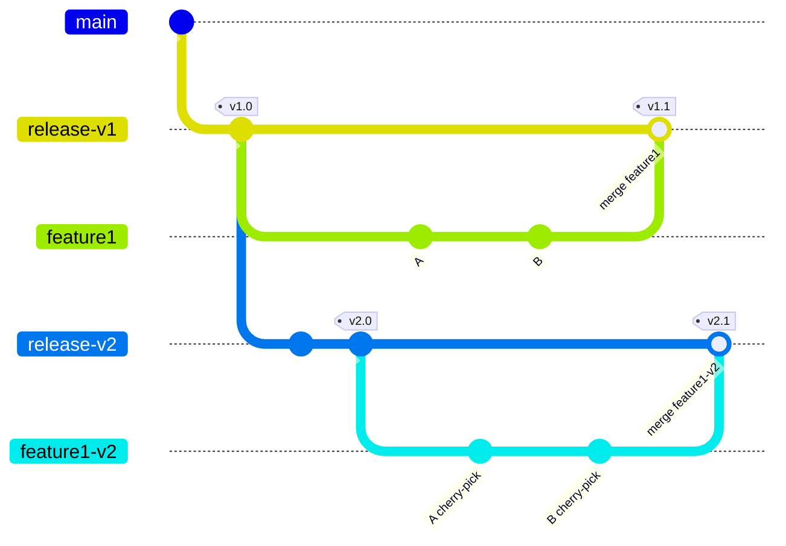

# Simplest Git Branching Model

This is a practical, lightweight, single-branch model that is suitable for many development situations.

It is adapted to teams of several developers, for delivering releases ASAP and maintaining several releases in parallel.

**TLDR**
```
    Single main branch
    One feature branch per task
    One dev per feature branch
    One PR per feature branch
    Delete feature branches after merge
```

Some more details below.

## Single branch model
* A branch `main` stores the latest version and all the tagged releases.
* Repository users must take care of checking out the tag or commit that best fits their needs.



## Adding features

### Adding a feature branch
* Create a `feature` branch from the last commit of `main`, like `git checkout main && git checkout -b feature`
* Only you (the developer) should use it.

### Publishing the feature
* Implement your feature in the `feature` branch.
* Rebase your branch onto `main`, like `git checkout feature && git rebase main`
* You (the developer) are responsible for the conflict management.
* Publish a Pull Request from `feature` onto `main` using a [GitHub](https://github.com/) Pull Request or a [GitLab](https://gitlab.com/) Merge Request.

## Merging features
* You (the software manager) should merge the feature branch to `main`.
* :x: This merge should not be done with option `--fast-forward`.
* Delete the feature branch. If something was missing or should be updated, a **new branch** must be created.
* Put a new tag on `main` if needed.
* :white_check_mark: Branches should look like:


## Issues and hotfixes
In this model, issues and hotfixes are treated the same way than features.

## Naming
* Naming dev branches, merges, commits, tags is up to your dev rules.
* Names could include some issue ID from your Project Management Software.

## Complex feature treated by more than one developer
* Still one branch per developer.
* Devs can checkout from other dev branches.
* Merges must be done back **onto their base branch**. In the following case, `feature_dev2` couldn't directly be merged back to `main`.
* Bubble merges should also be avoided, devs should rebase their work onto the base branch. That is what did `dev3` in the following diagram.



## Maintaining several releases
A common case is maintaining multiple major releases.
* Create one main branch per release.
* Keep separated feature branches for each release, even if the feature and change are the same. `git cherry-pick` can be your friend here.
* Publish one PR per release.
* Maintain your releases as if they were different softwares (they are!)



## DONTs

* :x: Avoid bubble merges
    ```mermaid
    gitGraph
        commit id: "ONE"
        branch feature1
        checkout main
        commit id:"TWO"
        branch feature2
        checkout feature1
        commit id:"A"
        checkout feature2
        commit id:"1"
        checkout feature1
        commit id:"B"
        checkout main
        merge feature1 id:"Merge feature1"
        checkout feature2
        commit id:"2"
        checkout main
        merge feature2 id:"Merge feature2"
    ```

    * Consider rebasing `feature2` onto main, like `git checkout feature2 && git rebase main` :white_check_mark:, you'll get a nicer branch like the one in [Merging features](#merging-features)
    * Don't merge `main` back to `feature2`, like `git checkout feature && git merge main` :x:, which will still lead to a bubble merge.

## Credits
* [Trunk-Based development workflow](https://trunkbaseddevelopment.com)
* [What is Git Flow](https://www.gitkraken.com/learn/git/git-flow)
* Popular Vincent Drissen's [A successful Git branching model](https://nvie.com/posts/a-successful-git-branching-model/), which I used for years (thank you Vincent)
* [GitLab Flow](https://about.gitlab.com/topics/version-control/what-is-gitlab-flow/)
* [GitHub Flow](https://docs.github.com/en/get-started/using-github/github-flow)
* Thanks to [jbenet](https://github.com/jbenet) for [this gist about a simple git branching model](https://gist.github.com/jbenet/ee6c9ac48068889b0912)
* Diagrams are done with [mermaid](https://mermaid.js.org/)
